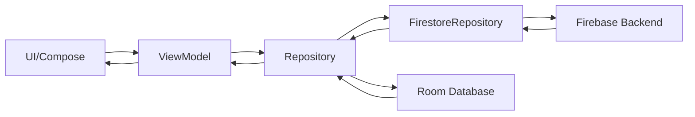

Casa de Historias follows modern Android development best practices with a clean architecture approach, utilizing MVVM pattern, Jetpack Compose for UI, and Hilt for dependency injection.

## Architecture Layers

The application is structured in three distinct layers following clean architecture principles:

<Steps>
  <Step title="UI Layer">
    Jetpack Compose screens and ViewModels handle user interactions and UI state
  </Step>
  <Step title="Domain Layer">
    Domain models represent core business entities (Story, User)
  </Step>
  <Step title="Data Layer">
    Repositories manage data from Firebase (remote) and Room (local)
  </Step>
</Steps>

## Technology Stack

<CardGroup cols={2}>
  <Card title="UI Framework" icon="palette">
    Jetpack Compose with Material Design 3
  </Card>
  <Card title="Dependency Injection" icon="plug">
    Hilt (Dagger-based)
  </Card>
  <Card title="Remote Backend" icon="cloud">
    Firebase (Auth, Firestore, Storage)
  </Card>
  <Card title="Local Storage" icon="database">
    Room Database
  </Card>
</CardGroup>

## MVVM Pattern

Casa de Historias implements the Model-View-ViewModel (MVVM) architectural pattern:

```kotlin
// ViewModel handles business logic and state
@HiltViewModel
class StoryViewModel @Inject constructor(
    private val repository: StoryRepository
) : ViewModel() {

    private val _stories = MutableStateFlow<List<Story>>(emptyList())
    val stories: StateFlow<List<Story>> = _stories.asStateFlow()

    private val _isLoading = MutableStateFlow(true)
    val isLoading: StateFlow<Boolean> = _isLoading.asStateFlow()

    init {
        loadStories()
    }

    private fun loadStories() {
        viewModelScope.launch {
            repository.getAllStoriesFlow()
                .catch { e -> _errorMessage.value = e.message }
                .collect { storyList -> _stories.value = storyList }
        }
    }
}
```

<Info>
ViewModels are scoped to the lifecycle of screens and survive configuration changes like screen rotations.
</Info>

## Application Entry Point

The app is initialized with Hilt's `@HiltAndroidApp` annotation:

```kotlin
package com.example.casadehistorias

import android.app.Application
import dagger.hilt.android.HiltAndroidApp

@HiltAndroidApp
class CasaDeHistoriasApp : Application()
```

<Note>
The `@HiltAndroidApp` annotation triggers Hilt's code generation and enables dependency injection throughout the app.
</Note>

## MainActivity Setup

The main activity is annotated with `@AndroidEntryPoint` to receive injected dependencies:

```kotlin
@AndroidEntryPoint
class MainActivity : ComponentActivity() {

    override fun onCreate(savedInstanceState: Bundle?) {
        super.onCreate(savedInstanceState)
        enableEdgeToEdge()
        setContent {
            CasaDeHistoriasTheme {
                Surface(modifier = Modifier.fillMaxSize()) {
                    MainContainer()
                }
            }
        }
    }
}
```

## Data Flow

The typical data flow in Casa de Historias follows this pattern:



<Steps>
  <Step title="User Interaction">
    User interacts with Compose UI components
  </Step>
  <Step title="ViewModel Processing">
    ViewModel receives events and updates state using StateFlow
  </Step>
  <Step title="Repository Coordination">
    Repository coordinates between Firebase (remote) and Room (local)
  </Step>
  <Step title="UI Update">
    ViewModel emits new state, Compose UI recomposes automatically
  </Step>
</Steps>

## Key Dependencies

From `app/build.gradle.kts:45-86`, here are the core libraries:

```kotlin
dependencies {
    // Core Android
    implementation(libs.androidx.core.ktx)
    implementation(libs.androidx.lifecycle.runtime.ktx)
    implementation(libs.androidx.activity.compose)
    implementation(libs.androidx.compose.material3)
    implementation(libs.androidx.navigation.compose)

    // Firebase
    implementation(platform(libs.firebase.bom))
    implementation(libs.firebase.firestore)
    implementation(libs.firebase.auth)
    implementation(libs.firebase.storage)

    // Room
    implementation(libs.androidx.room.runtime)
    implementation(libs.androidx.room.ktx)
    ksp(libs.androidx.room.compiler)

    // Hilt
    implementation(libs.hilt.android)
    ksp(libs.hilt.compiler)
    implementation(libs.hilt.navigation.compose)

    // Media & Images
    implementation(libs.coil.compose)
    implementation(libs.media3.exoplayer)
}
```

<Tip>
The app uses Kotlin Symbol Processing (KSP) instead of kapt for faster compilation times with Room and Hilt.
</Tip>

## Navigation Architecture

The app uses Jetpack Navigation Compose with type-safe routes:

```kotlin
sealed class Screen(val route: String) {
    object Welcome : Screen("welcome")
    object Discover : Screen("discover")
    object StoryList : Screen("story_list")
    object StoryDetail : Screen("story_detail/{storyId}") {
        fun createRoute(storyId: String) = "story_detail/$storyId"
    }
    // ... more screens
}
```

## Domain Models

The domain layer uses simple Kotlin data classes:

```kotlin
data class Story(
    val id: String,
    val titleEs: String,
    val titleNahuatl: String,
    val contentEs: String,
    val contentNahuatl: String,
    val audioUrl: String?,
    val imageUrl: String?,
    val narratorName: String,
    val community: String,
    val latitude: Double? = null,
    val longitude: Double? = null,
    val authorId: String = "",
    val tags: List<String> = emptyList(),
    val createdAt: Long = 0L
)
```

<Warning>
Domain models are separate from Firebase models (StoryFirestore) and Room entities (StoryEntity). Repositories handle conversion between these representations.
</Warning>

## Next Steps

<CardGroup cols={2}>
  <Card title="Data Layer" icon="database" href="/development/data-layer">
    Explore repositories, Firebase integration, and Room database
  </Card>
  <Card title="UI Layer" icon="mobile" href="/development/ui-layer">
    Learn about Compose screens, ViewModels, and navigation
  </Card>
  <Card title="Dependency Injection" icon="plug" href="/development/dependency-injection">
    Understand Hilt modules and dependency provision
  </Card>
</CardGroup>