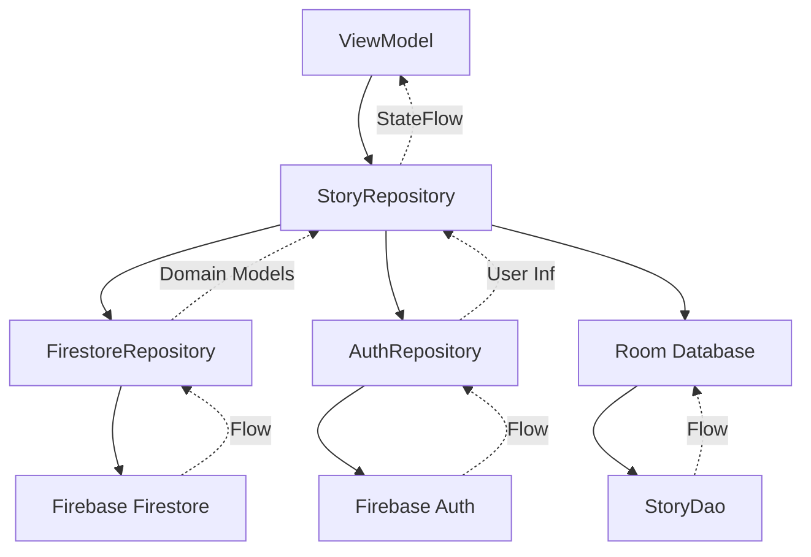

The data layer in Casa de Historias manages all data operations, coordinating between Firebase (remote backend) and Room (local database) to provide a single source of truth.

## Repository Pattern

Repositories abstract data sources and provide a clean API for the UI layer:

```kotlin
@Singleton
class StoryRepository @Inject constructor(
    private val firestoreRepository: FirestoreRepository,
    private val authRepository: AuthRepository
) {

    fun getAllStoriesFlow(): Flow<List<Story>> =
        firestoreRepository.getAllStoriesFlow().map { stories ->
            stories.map { it.toDomainModel() }
        }

    suspend fun getStoryById(id: String): Story? {
        return firestoreRepository.getStoryById(id)?.toDomainModel()
    }

    suspend fun addStory(story: Story): String? {
        val currentUser = authRepository.currentUser
        return if (currentUser != null) {
            val storyFirestore = story.toFirestoreModel(currentUser.uid)
            firestoreRepository.addStory(storyFirestore)
        } else null
    }
}
```

<Info>
Repositories are marked with `@Singleton` to ensure a single instance throughout the app lifecycle.
</Info>

## Firebase Integration

### FirestoreRepository

Handles all Firestore database operations:

```kotlin
@Singleton
class FirestoreRepository @Inject constructor(
    private val firestore: FirebaseFirestore
) {

    fun getAllStoriesFlow(): Flow<List<StoryFirestore>> = callbackFlow {
        val listener = firestore.collection("stories")
            .whereEqualTo("published", true)
            .orderBy("createdAt", Query.Direction.DESCENDING)
            .addSnapshotListener { snapshot, error ->
                if (error != null) {
                    close(error)
                    return@addSnapshotListener
                }

                val stories = snapshot?.documents?.mapNotNull { doc ->
                    doc.toObject(StoryFirestore::class.java)
                } ?: emptyList()

                trySend(stories)
            }

        awaitClose { listener.remove() }
    }

    suspend fun addStory(story: StoryFirestore): String? {
        return try {
            val documentRef = firestore.collection("stories").document()
            val storyWithId = story.copy(
                id = documentRef.id,
                createdAt = Timestamp.now(),
                updatedAt = Timestamp.now()
            )
            documentRef.set(storyWithId).await()
            documentRef.id
        } catch (e: Exception) {
            null
        }
    }
}
```

<Note>
Firestore operations use Kotlin Coroutines with `await()` for suspend functions and `callbackFlow` for real-time updates.
</Note>

### Key Firestore Operations

<Steps>
  <Step title="Real-time Listening">
    Use `addSnapshotListener` with `callbackFlow` to get live updates
  </Step>
  <Step title="Querying">
    Filter with `whereEqualTo`, sort with `orderBy`, limit results
  </Step>
  <Step title="Writing">
    Use `set()` for creating/updating, `update()` for partial updates
  </Step>
  <Step title="Error Handling">
    Wrap operations in try-catch blocks and return sensible defaults
  </Step>
</Steps>

### AuthRepository

Manages Firebase Authentication and user profiles:

```kotlin
@Singleton
class AuthRepository @Inject constructor(
    private val auth: FirebaseAuth,
    private val firestore: FirebaseFirestore
) {

    val currentUser: FirebaseUser? get() = auth.currentUser

    val authState: Flow<FirebaseUser?> = callbackFlow {
        val listener = FirebaseAuth.AuthStateListener { auth ->
            trySend(auth.currentUser)
        }
        auth.addAuthStateListener(listener)
        awaitClose { auth.removeAuthStateListener(listener) }
    }

    suspend fun signInWithEmailAndPassword(
        email: String, 
        password: String
    ): Result<FirebaseUser?> {
        return try {
            val result = auth.signInWithEmailAndPassword(email, password).await()
            updateLastLogin(result.user?.uid)
            Result.success(result.user)
        } catch (e: Exception) {
            Result.failure(e)
        }
    }

    suspend fun createUserWithEmailAndPassword(
        email: String, 
        password: String,
        displayName: String,
        community: String
    ): Result<FirebaseUser?> {
        return try {
            val result = auth.createUserWithEmailAndPassword(email, password).await()
            result.user?.let { user ->
                createUserProfile(user.uid, email, displayName, community)
            }
            Result.success(result.user)
        } catch (e: Exception) {
            Result.failure(e)
        }
    }
}
```

<Tip>
AuthRepository exposes `authState` as a Flow that emits whenever the user's authentication status changes, perfect for navigation logic.
</Tip>

## Room Database

### Database Definition

The Room database is defined with entities and version management:

```kotlin
@Database(
    entities = [StoryEntity::class], 
    version = 1,
    exportSchema = false
)
abstract class AppDatabase : RoomDatabase() {
    abstract fun storyDao(): StoryDao
}
```

### Story Entity

Local database representation of stories for offline access:

```kotlin
@Entity(tableName = "stories")
data class StoryEntity(
    @PrimaryKey val id: String,
    val titleEs: String,
    val titleNahuatl: String,
    val contentEs: String,
    val contentNahuatl: String,
    val audioPath: String?, // Local file path
    val imagePath: String?, // Local file path
    val narratorName: String,
    val community: String,
    val isFavorite: Boolean = false
)
```

<Warning>
Note that `StoryEntity` uses local file paths (`audioPath`, `imagePath`) while domain models and Firestore models use URLs. This enables offline functionality.
</Warning>

### Data Access Object (DAO)

Defines database operations:

```kotlin
@Dao
interface StoryDao {
    @Query("SELECT * FROM stories")
    fun getAllStories(): Flow<List<StoryEntity>>

    @Query("SELECT * FROM stories WHERE id = :id")
    suspend fun getStoryById(id: String): StoryEntity?

    @Insert(onConflict = OnConflictStrategy.REPLACE)
    suspend fun insertStories(stories: List<StoryEntity>)

    @Delete
    suspend fun deleteStory(story: StoryEntity)
}
```

<Info>
DAO methods can return `Flow` for reactive updates or use `suspend` for one-time operations.
</Info>

## Data Model Conversion

Repositories handle conversion between different data representations:

```kotlin
// Extension functions for converting between models
private fun StoryFirestore.toDomainModel(): Story {
    return Story(
        id = this.id,
        titleEs = this.titleEs,
        titleNahuatl = this.titleNahuatl,
        contentEs = this.contentEs,
        contentNahuatl = this.contentNahuatl,
        audioUrl = this.audioUrl,
        imageUrl = this.imageUrl,
        narratorName = this.narratorName,
        community = this.community,
        latitude = this.latitude,
        longitude = this.longitude,
        authorId = this.authorId,
        tags = this.tags,
        createdAt = this.createdAt.seconds * 1000
    )
}

private fun Story.toFirestoreModel(authorId: String): StoryFirestore {
    return StoryFirestore(
        id = this.id,
        titleEs = this.titleEs,
        titleNahuatl = this.titleNahuatl,
        contentEs = this.contentEs,
        contentNahuatl = this.contentNahuatl,
        audioUrl = this.audioUrl,
        imageUrl = this.imageUrl,
        narratorName = this.narratorName,
        community = this.community,
        authorId = authorId,
        published = true,
        latitude = this.latitude,
        longitude = this.longitude,
        tags = this.tags
    )
}
```

## Data Flow Architecture



## Search Implementation

Firestore limitations require client-side filtering for flexible search:

```kotlin
suspend fun searchStories(query: String): List<StoryFirestore> {
    return try {
        // Fetch all published stories and filter locally
        val snapshot = firestore.collection("stories")
            .whereEqualTo("published", true)
            .get()
            .await()

        val allStories = snapshot.documents.mapNotNull { doc ->
            doc.toObject(StoryFirestore::class.java)
        }

        val lowerQuery = query.lowercase()
        allStories.filter { story ->
            story.titleEs.lowercase().contains(lowerQuery) ||
            story.titleNahuatl.lowercase().contains(lowerQuery) ||
            story.narratorName.lowercase().contains(lowerQuery) ||
            story.community.lowercase().contains(lowerQuery) ||
            story.tags.any { it.lowercase().contains(lowerQuery) }
        }
    } catch (e: Exception) {
        emptyList()
    }
}
```

<Note>
Client-side search provides more flexibility than Firestore's limited query capabilities, especially for multi-field searches.
</Note>

## Favorites Management

User favorites are stored as an array in the user document:

```kotlin
suspend fun addToFavorites(userId: String, storyId: String): Boolean {
    return try {
        firestore.collection("users").document(userId)
            .update("favoriteStories", FieldValue.arrayUnion(storyId))
            .await()
        true
    } catch (e: Exception) {
        false
    }
}

suspend fun removeFromFavorites(userId: String, storyId: String): Boolean {
    return try {
        firestore.collection("users").document(userId)
            .update("favoriteStories", FieldValue.arrayRemove(storyId))
            .await()
        true
    } catch (e: Exception) {
        false
    }
}
```

<Tip>
Using `FieldValue.arrayUnion()` and `arrayRemove()` provides atomic operations for managing array fields in Firestore.
</Tip>

## Error Handling Strategy

<Steps>
  <Step title="Try-Catch Blocks">
    Wrap all Firebase operations in try-catch to handle network errors
  </Step>
  <Step title="Sensible Defaults">
    Return empty lists or null instead of throwing exceptions
  </Step>
  <Step title="Result Types">
    Use Kotlin's `Result<T>` for operations that may succeed or fail
  </Step>
  <Step title="Flow Error Handling">
    Use `.catch { }` operator for Flow-based operations
  </Step>
</Steps>

## Related Documentation

<CardGroup cols={2}>
  <Card title="Architecture Overview" icon="sitemap" href="/development/architecture-overview">
    See how the data layer fits into overall architecture
  </Card>
  <Card title="UI Layer" icon="mobile" href="/development/ui-layer">
    Learn how ViewModels consume repository data
  </Card>
  <Card title="Dependency Injection" icon="plug" href="/development/dependency-injection">
    Understand how repositories are provided via Hilt
  </Card>
</CardGroup>