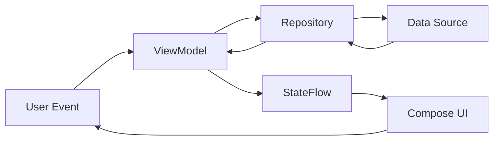

The UI layer of Casa de Historias is built entirely with Jetpack Compose, using Material Design 3 with a custom "Noche Mística" (Mystical Night) theme inspired by the Sierra de Zongolica.

## Jetpack Compose Architecture

Casa de Historias uses a unidirectional data flow pattern:



<Steps>
  <Step title="Event">
    User interacts with UI (button click, text input)
  </Step>
  <Step title="ViewModel">
    ViewModel processes event and updates state
  </Step>
  <Step title="State Emission">
    New state is emitted via StateFlow
  </Step>
  <Step title="Recomposition">
    Compose UI automatically recomposes with new state
  </Step>
</Steps>

## ViewModels

### StoryViewModel

Manages story-related UI state and operations:

```kotlin
@HiltViewModel
class StoryViewModel @Inject constructor(
    private val repository: StoryRepository
) : ViewModel() {

    private val _stories = MutableStateFlow<List<Story>>(emptyList())
    val stories: StateFlow<List<Story>> = _stories.asStateFlow()

    private val _isLoading = MutableStateFlow(true)
    val isLoading: StateFlow<Boolean> = _isLoading.asStateFlow()

    private val _errorMessage = MutableStateFlow<String?>(null)
    val errorMessage: StateFlow<String?> = _errorMessage.asStateFlow()

    private val _selectedStory = MutableStateFlow<Story?>(null)
    val selectedStory: StateFlow<Story?> = _selectedStory.asStateFlow()

    init {
        loadStories()
    }

    private fun loadStories() {
        viewModelScope.launch {
            _isLoading.value = true
            _errorMessage.value = null
            repository.getAllStoriesFlow()
                .catch { e ->
                    Log.e("StoryViewModel", "Error cargando historias: ${e.message}")
                    _errorMessage.value = "Error al cargar historias: ${e.message}"
                    _isLoading.value = false
                }
                .collect { storyList ->
                    _stories.value = storyList
                    _isLoading.value = false
                }
        }
    }

    fun loadStoryById(id: String) {
        viewModelScope.launch {
            _isLoading.value = true
            // First try from local list
            val localStory = _stories.value.find { it.id == id }
            if (localStory != null) {
                _selectedStory.value = localStory
                _isLoading.value = false
                return@launch
            }
            // Otherwise fetch from Firestore
            val story = repository.getStoryById(id)
            _selectedStory.value = story
            _isLoading.value = false
        }
    }
}
```

<Info>
`@HiltViewModel` enables automatic dependency injection. ViewModels are scoped to the navigation destination lifecycle.
</Info>

### AuthViewModel

Handles authentication state and user profile:

```kotlin
@HiltViewModel
class AuthViewModel @Inject constructor(
    private val authRepository: AuthRepository
) : ViewModel() {

    private val _authState = MutableStateFlow<AuthState>(AuthState.Loading)
    val authState: StateFlow<AuthState> = _authState.asStateFlow()

    private val _userProfile = MutableStateFlow<UserProfile?>(null)
    val userProfile: StateFlow<UserProfile?> = _userProfile.asStateFlow()

    val isLoggedIn: Boolean get() = authRepository.currentUser != null

    init {
        viewModelScope.launch {
            authRepository.authState.collect { user ->
                if (user != null) {
                    _authState.value = AuthState.Authenticated(user)
                    loadUserProfile(user.uid)
                } else {
                    _authState.value = AuthState.Unauthenticated
                    _userProfile.value = null
                }
            }
        }
    }

    fun signIn(email: String, password: String) {
        viewModelScope.launch {
            _authState.value = AuthState.Loading
            val result = authRepository.signInWithEmailAndPassword(email, password)
            if (result.isFailure) {
                _authState.value = AuthState.Error(
                    result.exceptionOrNull()?.message ?: "Error desconocido"
                )
            }
        }
    }
}

sealed class AuthState {
    object Loading : AuthState()
    object Unauthenticated : AuthState()
    data class Authenticated(val user: FirebaseUser) : AuthState()
    data class Error(val message: String) : AuthState()
}
```

<Note>
Sealed classes are perfect for representing finite UI states, making state handling exhaustive and type-safe.
</Note>

## Navigation

### Route Definition

Routes are defined as a sealed class for type safety:

```kotlin
sealed class Screen(val route: String) {
    object Welcome : Screen("welcome")
    object Discover : Screen("discover")
    object Dictionary : Screen("dictionary")
    object Login : Screen("login")
    object SignUp : Screen("signup")
    object StoryList : Screen("story_list")
    object AddStory : Screen("add_story")
    object StoryMap : Screen("story_map")
    object Favorites : Screen("favorites")
    object Profile : Screen("profile")
    object Search : Screen("search")
    object Settings : Screen("settings")
    object StoryDetail : Screen("story_detail/{storyId}") {
        fun createRoute(storyId: String) = "story_detail/$storyId"
    }
    object EditStory : Screen("edit_story/{storyId}") {
        fun createRoute(storyId: String) = "edit_story/$storyId"
    }
}
```

<Tip>
Using companion functions like `createRoute()` ensures type-safe navigation with parameters.
</Tip>

### NavGraph Implementation

The navigation graph connects all screens:

```kotlin
@Composable
fun NavGraph(
    navController: NavHostController,
    authViewModel: AuthViewModel,
    startDestination: String
) {
    val storyViewModel: StoryViewModel = hiltViewModel()
    val favoritesViewModel: FavoritesViewModel = hiltViewModel()

    NavHost(
        navController = navController,
        startDestination = startDestination
    ) {
        composable(Screen.StoryList.route) {
            StoryListScreen(
                viewModel = storyViewModel,
                onStoryClick = { storyId ->
                    navController.navigate(Screen.StoryDetail.createRoute(storyId))
                },
                onAddStoryClick = {
                    navController.navigate(Screen.AddStory.route)
                }
            )
        }

        composable(
            route = Screen.StoryDetail.route,
            arguments = listOf(
                navArgument("storyId") { type = NavType.StringType }
            )
        ) { backStackEntry ->
            val storyId = backStackEntry.arguments?.getString("storyId") ?: ""
            val stories by storyViewModel.stories.collectAsState()
            val story = stories.find { it.id == storyId }

            LaunchedEffect(storyId) {
                if (story == null) {
                    storyViewModel.loadStoryById(storyId)
                }
            }

            val selectedStory by storyViewModel.selectedStory.collectAsState()
            val displayStory = story ?: selectedStory

            if (displayStory != null) {
                StoryDetailScreen(
                    story = displayStory,
                    favoritesViewModel = favoritesViewModel,
                    onNavigateBack = { navController.popBackStack() }
                )
            }
        }
    }
}
```

<Warning>
When using `hiltViewModel()` in NavGraph, ViewModels are scoped to their navigation entry. Share ViewModels across screens by hoisting them to the NavGraph level.
</Warning>

## Material Design 3 Theming

### Custom "Noche Mística" Theme

Inspired by the mystical nights of Sierra de Zongolica:

```kotlin
/**
 * Casa de Historias - Paleta "Noche Mística"
 * Colores que evocan una noche de leyendas en la Sierra de Zongolica
 */

// 🌑 Fondo: Azul Noche Profunda (Modernizado, Slate 900)
val NocheProfunda = Color(0xFF0F172A)

// 💧 Primario: Turquesa Brillante (Cyan vibrante)
val AguaSagrada = Color(0xFF06B6D4)
val AguaSagradaOscura = Color(0xFF0891B2)

// ❤️ Acento: Rojo/Coral Intenso (Rose vibrante)
val FloresCeremoniales = Color(0xFFF43F5E)
val FloresCeremonialesOscuras = Color(0xFFE11D48)

// 📄 Texto
val LunaLlena = Color(0xFFF8FAFC)
val TextoSecundario = Color(0xFF94A3B8)

// Superficies (Glassmorphism ready)
val FondoTarjeta = Color(0xCC1E293B) // Con un poco de transparencia
val SurfaceVariant = Color(0xFF334155)
```

### Theme Application

```kotlin
private val CasaDeHistoriasColorScheme = darkColorScheme(
    primary = AguaSagrada,
    onPrimary = NocheProfunda,
    primaryContainer = AguaSagradaOscura,
    onPrimaryContainer = LunaLlena,

    secondary = FloresCeremoniales,
    onSecondary = LunaLlena,
    secondaryContainer = FloresCeremonialesOscuras,
    onSecondaryContainer = LunaLlena,

    background = NocheProfunda,
    onBackground = LunaLlena,
    surface = FondoTarjeta,
    onSurface = LunaLlena,

    outline = TextoSecundario,
    surfaceVariant = SurfaceVariant,
    onSurfaceVariant = TextoSecundario,

    error = FloresCeremoniales,
    onError = LunaLlena
)

@Composable
fun CasaDeHistoriasTheme(
    content: @Composable () -> Unit
) {
    val colorScheme = CasaDeHistoriasColorScheme

    val view = LocalView.current
    if (!view.isInEditMode) {
        SideEffect {
            val window = (view.context as Activity).window
            window.statusBarColor = NocheProfunda.toArgb()
            WindowCompat.getInsetsController(window, view)
                .isAppearanceLightStatusBars = false
        }
    }

    MaterialTheme(
        colorScheme = colorScheme,
        typography = Typography,
        content = content
    )
}
```

<Info>
The theme uses Material Design 3's `darkColorScheme` with culturally significant colors that evoke the mystical atmosphere of indigenous legends.
</Info>

## UI State Management Patterns

### StateFlow Collection

Collecting state in Compose:

```kotlin
@Composable
fun StoryListScreen(
    viewModel: StoryViewModel = hiltViewModel(),
    onStoryClick: (String) -> Unit
) {
    val stories by viewModel.stories.collectAsState()
    val isLoading by viewModel.isLoading.collectAsState()
    val errorMessage by viewModel.errorMessage.collectAsState()

    when {
        isLoading -> LoadingIndicator()
        errorMessage != null -> ErrorView(errorMessage!!)
        stories.isEmpty() -> EmptyStateView()
        else -> StoryList(stories, onStoryClick)
    }
}
```

<Tip>
`collectAsState()` automatically handles lifecycle management and cancels collection when the composable leaves composition.
</Tip>

### LaunchedEffect for Side Effects

```kotlin
LaunchedEffect(storyId) {
    if (story == null) {
        storyViewModel.loadStoryById(storyId)
    }
}
```

<Note>
`LaunchedEffect` is key-based - it cancels and restarts when the key (storyId) changes, perfect for fetching data when parameters change.
</Note>

## Compose Best Practices

<Steps>
  <Step title="State Hoisting">
    Keep state in ViewModels or hoist to parent composables
  </Step>
  <Step title="Stateless Composables">
    Make UI components accept state and emit events
  </Step>
  <Step title="Remember for Local State">
    Use `remember` for UI-only state that doesn't need to survive process death
  </Step>
  <Step title="Derived State">
    Use `derivedStateOf` for computed values to avoid unnecessary recompositions
  </Step>
</Steps>

## Accessibility Considerations

```kotlin
Button(
    onClick = { onStoryClick(story.id) },
    modifier = Modifier.semantics {
        contentDescription = "Ver historia: ${story.titleEs}"
    }
) {
    Text(story.titleEs)
}
```

<Warning>
Always provide content descriptions for interactive elements to support screen readers and accessibility services.
</Warning>

## Performance Optimization

### Key Usage in Lists

```kotlin
LazyColumn {
    items(
        items = stories,
        key = { story -> story.id }
    ) { story ->
        StoryCard(
            story = story,
            onClick = { onStoryClick(story.id) }
        )
    }
}
```

<Tip>
Providing a `key` parameter helps Compose identify items across recompositions, improving performance for list operations.
</Tip>

## Screen Types

The app includes various screen types:

<CardGroup cols={2}>
  <Card title="Authentication" icon="lock">
    LoginScreen, SignUpScreen with form validation
  </Card>
  <Card title="Story Browsing" icon="book">
    StoryListScreen, DiscoverScreen, StoryMapScreen
  </Card>
  <Card title="Story Management" icon="pen">
    AddStoryScreen, EditStoryScreen for content creation
  </Card>
  <Card title="User Features" icon="user">
    ProfileScreen, FavoritesScreen, SettingsScreen
  </Card>
</CardGroup>

## Related Documentation

<CardGroup cols={2}>
  <Card title="Architecture Overview" icon="sitemap" href="/development/architecture-overview">
    Understand overall MVVM architecture
  </Card>
  <Card title="Data Layer" icon="database" href="/development/data-layer">
    Learn how ViewModels consume repository data
  </Card>
  <Card title="Dependency Injection" icon="plug" href="/development/dependency-injection">
    See how ViewModels receive dependencies
  </Card>
</CardGroup>